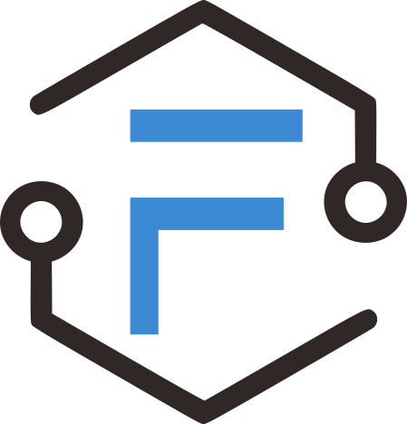

# Node-RED Node Package - Sample Node

## Description

This Node-RED node package provides custom nodes for writing data to Forge Tags as well as subscribing to Forge Events.



## Installation

To install this node package, you can use the Node-RED "Manage palette" feature or manually install it via npm.

### Using Node-RED "Manage palette"

1. Open your Node-RED instance.
2. Click on the hamburger menu (☰) in the top-right corner and select "Manage palette."
3. Go to the "Install" tab, search for "@factory-frameworks/forge," and click "Install."

### Manual Installation via npm

1. Change your current directory to your Node-RED user directory (typically ~/.node-red).
2. Run the following command to install the node package:

```bash
npm @factory-frameworks/forge
```
